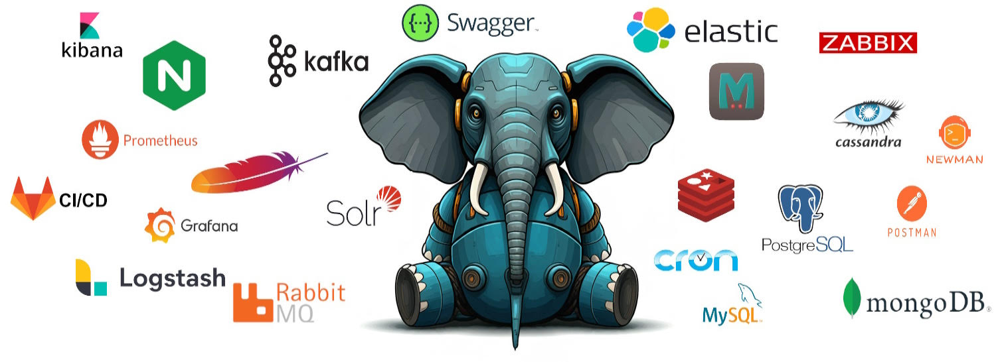

# Enterprise Skeleton Project




A comprehensive project skeleton for enterprise applications with integrated support for essential development services, following Domain-Driven Design (DDD) principles and Clean Architecture.

## Table of Contents

- [Features](#features)
- [Requirements](#requirements)
- [Quick Start](#quick-start)
- [Frameworks](#frameworks)
- [Project Structure](#project-structure)
- [Architecture](#architecture)
- [Infrastructure Components](#infrastructure-components)
- [Development Tools](#development-tools)
- [Configuration](#configuration)
- [Environment Variables](#environment-variables)
- [Database Migrations](#database-migrations)
- [Testing](#testing)
- [Troubleshooting](#troubleshooting)
- [Contributing](#contributing)
- [License](#license)

## Features

- Modern PHP 8.5 with strict typing (`declare(strict_types=1)`)
- Multiple web servers (Nginx, Apache)
- SQL databases (PostgreSQL, MySQL)
- NoSQL databases (MongoDB, Cassandra)
- Caching solutions (Redis, Memcached)
- Message brokers (RabbitMQ, Kafka)
- Search engines (Elasticsearch, Solr)
- Monitoring tools (Grafana, Zabbix, Prometheus)
- Mail testing (MailHog, Papercut)
- Logging systems (Kibana, Graylog, ELK stack)
- API documentation (Swagger/OpenAPI)
- Task scheduling (Cron)
- CQRS pattern with separate command/query/event buses
- Event Sourcing with Outbox pattern
- Request tracking with UUID v4

## Requirements

| Requirement      | Version |
|------------------|---------|
| Docker           | 24.0+   |
| Docker Compose   | 2.20+   |
| Make             | 3.81+   |
| Git              | 2.0+    |

## Quick Start

1. Clone the repository:
```bash
git clone https://github.com/your-org/enterprise-skeleton.git
cd enterprise-skeleton
```

2. Copy configuration:
```bash
make copy-config
```

3. Configure environment:
   - Edit `infrastructure/config/cs-config` to customize services
   - Uncomment what you need:
```ini
server=nginx            # Web Server: nginx, apache
database=postgres       # Database Service: postgres, mysql
;nosql=mongodb          # NoSQL Database Service: mongodb, cassandra
cache=redis             # Cache Service: redis, memcached
;search=elasticsearch   # Search: elasticsearch, solr
;message=kafka          # Message Broker: rabbitmq, kafka
docs=swagger            # API Documentation: swagger
;mailer=mailhog         # Mail Sandbox: mailhog, papercut
;monitoring=grafana     # Monitoring: grafana, zabbix
;logs=kibana            # Log Management: kibana, graylog
;job=cron               # Scheduling Jobs: cron
```

4. Install and start:
```bash
make install
```

5. Access the application:
   - HTTP: http://localhost:1000
   - HTTPS: https://localhost:1001
   - API Docs: http://localhost:1002

## Frameworks

<div style="display: flex; justify-content: space-around; align-items: center;">
    <a href="https://symfony.com" target="_blank">
        
    </a>
    <a href="https://laravel.com" target="_blank">
        
    </a>
</div>

Switch between frameworks:
```bash
# Switch to Laravel framework
make framework laravel

# Switch to Symfony framework
make framework symfony
```

## Project Structure

```
enterprise-skeleton/
├── code/                   # Application source code
│   ├── src/                # Domain modules
│   ├── config/             # Framework configuration
│   ├── migrations/         # Database migrations
│   └── tests/              # Test suite
├── infrastructure/         # Docker and infrastructure
│   ├── containers/         # Container configurations
│   ├── config/             # Infrastructure config
│   ├── scripts/            # Build scripts
│   └── docker-compose.yml  # Service composition
└── tools/                  # Development tools
    ├── postman/            # API test collections
    └── .php-cs-fixer.php   # Code style configuration
```

For detailed documentation:
- **Application**: See [`code/README.md`](code/README.md) for architecture, domains, and code organization
- **Infrastructure**: See [`infrastructure/README.md`](infrastructure/README.md) for Docker services and deployment

## Architecture

### Domain-Driven Design (DDD)

The application follows a layered DDD architecture:

| Layer              | Purpose                                        | Location                   |
|--------------------|------------------------------------------------|----------------------------|
| **Presentation**   | Handles HTTP/CLI requests, maps input to DTOs  | `Api/`, `Console/`, `Web/` |
| **Application**    | Business operations, orchestrates domain logic | `Application/UseCases/`    |
| **Domain**         | Core business logic, no external dependencies  | `DomainModel/`             |
| **Infrastructure** | Technical implementations                      | `Infrastructure/`          |

### Domain Module Structure

```
src/
└── YourDomain/
    ├── Application/
    │   └── UseCases/
    │       ├── Query/
    │       └── Command/
    ├── DomainModel/
    │   ├── Model/
    │   ├── Repository/
    │   └── Service/
    ├── Infrastructure/
    │   ├── Persistence/
    │   └── Clients/
    ├── Presentation/
    │   ├── Api/
    │   ├── Console/
    │   └── Web/
    ├── Resources/
    │   └── Config/
    └── Tests/
        ├── Unit/
        └── Integration/
```

### CQRS (Command Query Responsibility Segregation)

Three separate message buses handle different concerns:

| Bus           | Purpose                           | Usage                         |
|---------------|-----------------------------------|-------------------------------|
| `command.bus` | Write operations                  | `$commandBus->dispatch($cmd)` |
| `query.bus`   | Read operations                   | `$queryBus->dispatch($query)` |
| `event.bus`   | Domain events, async processing   | `$eventBus->dispatch($event)` |

### Event Sourcing with Outbox Pattern

Reliable event publishing using transactional outbox ensures events are persisted in the same transaction as domain changes:

```
Transaction Start
├── Save Domain Entity
├── Save Event to Outbox Table
Transaction Commit

Background Process
├── Read Outbox Events
├── Publish to Message Broker
└── Mark as Processed
```

### Shared Module

The `Shared/` module provides cross-cutting components:

| Component         | Purpose                                              |
|-------------------|------------------------------------------------------|
| `DomainModel/`    | Base entities, value objects, interfaces, exceptions |
| `Infrastructure/` | Event store, message bus, HTTP client, rate limiting |
| `Presentation/`   | Base actions, commands, responders                   |

### ADR Pattern (Action-Domain-Responder)

Presentation layer follows the ADR pattern for clean request handling:

- **Action** - Receives HTTP request, calls use case
- **Domain** - Business logic (UseCase)
- **Responder** - Formats and returns response

## Infrastructure Components

PHP container is built automatically based on selected services.

| Category            | Service                                     | Version                  | Access URL                                      |
|---------------------|---------------------------------------------|--------------------------|-------------------------------------------------|
| **Web Servers**     | Nginx<br>Apache                             | latest<br>2.4            | http://localhost:1000<br>https://localhost:1001 |
| **Databases**       | PostgreSQL<br>MySQL<br>MongoDB<br>Cassandra | 15<br>8.0<br>6.0<br>4.1  | -                                               |
| **Caching**         | Redis<br>Memcached                          | 7.2-alpine<br>1.6-alpine | -                                               |
| **Message Brokers** | RabbitMQ<br>Kafka                           | 3.12-alpine<br>3.3.1     | http://localhost:15672<br>http://localhost:8080 |
| **Search**          | Elasticsearch<br>Solr                       | 8.11.1<br>9.4            | -                                               |
| **Monitoring**      | Zabbix<br>Grafana<br>Prometheus             | 6.4<br>10.2.0<br>latest  | http://localhost:8081<br>http://localhost:3000  |
| **Mail Testing**    | MailHog<br>Papercut                         | v1.0.1<br>5.7.0          | http://localhost:8025<br>http://localhost:37408 |
| **Logging**         | Kibana<br>Graylog                           | 8.11.1<br>5.2            | http://localhost:5601<br>http://localhost:9400  |
| **Documentation**   | Swagger                                     | v5.9.1                   | http://localhost:1002                           |
| **Task Scheduling** | Cron                                        | PHP 8.5-cli              | -                                               |

## Development Tools

| Tool         | Purpose                 | Command             |
|--------------|-------------------------|---------------------|
| PHP CS Fixer | Code standards (PSR-12) | `make phpcs`        |
| Deptrac      | Architecture validation | `make deptrac`      |
| PHPStan      | Static analysis         | `make phpstan`      |
| Psalm        | Type checking           | `make psalm`        |
| PhpMetrics   | Code metrics            | `make phpmetrics`   |
| PHPUnit      | Unit/Integration tests  | `make test-php`     |
| Newman       | API testing             | `make test-postman` |

### Make Commands

| Category         | Command             | Purpose                                     |
|------------------|---------------------|---------------------------------------------|
| **Config**       | `make copy-config`  | Copy cs-config.ini.dist to cs-config        |
|                  | `make show-config`  | Display current configuration               |
| **Quality**      | `make ci`           | Run all code quality checks                 |
|                  | `make cc`           | Clear caches and dump autoload              |
| **Logs**         | `make logs-cron`    | View cron output logs                       |
|                  | `make logs-php`     | View PHP logs                               |
| **Docker**       | `make up`           | Start containers                            |
|                  | `make down`         | Stop containers                             |
|                  | `make restart`      | Restart containers                          |

## Configuration

### Graylog Setup

1. Install GELF PHP package:
```bash
composer require graylog2/gelf-php
```

2. Configure UDP Input:
   - Access http://localhost:9400
   - Navigate to System -> Inputs
   - Add "GELF UDP" input on port 12201

### ELK Stack (Elasticsearch, Kibana, Logstash)

1. Create index:
```bash
curl -X PUT http://localhost:9200/logs \
  -H "Content-Type: application/json" \
  -d '{
    "settings": {
      "number_of_shards": 1,
      "number_of_replicas": 0
    },
    "mappings": {
      "properties": {
        "@timestamp": {"type": "date"},
        "message": {"type": "text"},
        "level": {"type": "keyword"},
        "channel": {"type": "keyword"},
        "context": {"type": "object"}
      }
    }
  }'
```

2. Reload Logstash:
```bash
docker compose -f infrastructure/docker-compose-tools.yml --profile elk restart logstash
```

### SSL/HTTPS

- Development certificates included for local HTTPS
- HTTP to HTTPS redirect supported
- TLS 1.2/1.3 support
- Custom certificates: place in `infrastructure/containers/nginx/ssl/` or `infrastructure/containers/apache/ssl/`

## Environment Variables

Key environment variables in `infrastructure/.env`:

| Variable         | Default   | Description               |
|------------------|-----------|---------------------------|
| `APP_ENV`        | `dev`     | Application environment   |
| `APP_DEBUG`      | `true`    | Debug mode                |
| `DB_HOST`        | `postgres`| Database host             |
| `DB_PORT`        | `5432`    | Database port             |
| `DB_NAME`        | `app`     | Database name             |
| `DB_USER`        | `app`     | Database user             |
| `DB_PASSWORD`    | `secret`  | Database password         |
| `REDIS_HOST`     | `redis`   | Redis host                |
| `REDIS_PORT`     | `6379`    | Redis port                |
| `RABBITMQ_HOST`  | `rabbitmq`| RabbitMQ host             |
| `RABBITMQ_PORT`  | `5672`    | RabbitMQ port             |

See `infrastructure/.env` for complete configuration options.

## Database Migrations

Run migrations using Doctrine:

```bash
# Run all pending migrations
docker compose exec php bin/console doctrine:migrations:migrate

# Check migration status
docker compose exec php bin/console doctrine:migrations:status

# Generate new migration
docker compose exec php bin/console doctrine:migrations:diff

# Rollback last migration
docker compose exec php bin/console doctrine:migrations:migrate prev
```

Or use Make commands:
```bash
make migrate          # Run migrations
make migrate-status   # Check status
```

## Testing

### Unit Tests

```bash
# Run all unit tests
make test-php

# Run with coverage
docker compose exec php ./vendor/bin/phpunit --coverage-html var/coverage
```

### API Tests (Newman/Postman)

```bash
# Run Postman collection
make test-postman
```

Postman collections are located in `tools/postman/`.

### Health Check Commands

Test service connectivity:

```bash
# Test database connections
docker compose exec php bin/console healthcheck:postgres
docker compose exec php bin/console healthcheck:mysql

# Test cache services
docker compose exec php bin/console healthcheck:redis
docker compose exec php bin/console healthcheck:memcache

# Test message brokers
docker compose exec php bin/console healthcheck:rabbitmq
docker compose exec php bin/console healthcheck:kafka
```

All commands return:
- `0` (Success): Service is available and functioning
- `1` (Failure): Connection issues or service malfunction

## Troubleshooting

### Port Conflicts

If ports are already in use, modify `infrastructure/.env`:

```ini
NGINX_HTTP_PORT=8080
NGINX_HTTPS_PORT=8443
POSTGRES_PORT=5433
REDIS_PORT=6380
```

### Permission Issues

```bash
# Fix volume permissions
sudo chown -R 1000:1000 infrastructure/data/
```

### Container Won't Start

```bash
# Check logs
docker compose logs <service-name>

# Rebuild container
docker compose build --no-cache <service-name>

# Full rebuild
make rebuild
```

### PHP Extensions Missing

The PHP container automatically builds with extensions based on selected services. If an extension is missing:

```bash
# Rebuild PHP container
docker compose build --no-cache php
```

### Database Connection Issues

1. Verify the database container is running:
```bash
docker compose ps
```

2. Check database logs:
```bash
docker compose logs postgres  # or mysql
```

3. Test connection from PHP container:
```bash
docker compose exec php bin/console healthcheck:postgres
```

### Cache/Session Issues

```bash
# Clear application cache
docker compose exec php bin/console cache:clear

# Clear Redis
docker compose exec redis redis-cli FLUSHALL
```

## Contributing

We welcome contributions to the Enterprise Skeleton project!

### Current Development Priorities

- **Sentry Integration**: Error tracking and monitoring
- **RoadRunner Integration**: High-performance PHP application server
- **New Framework Integrations**: Yii, Slim, or other PHP frameworks

### How to Submit a Pull Request

1. Fork the repository
2. Create a new branch for your feature or fix
3. Make your changes following our coding standards (PSR-12)
4. Write or update tests if necessary
5. Submit a Pull Request with a clear description
6. Ensure all checks pass (PHPStan, Psalm, CS-Fixer, etc.)

## License

This project is licensed under the [MIT License](LICENSE).

## Author

[Dykyi Roman](https://dykyi-roman.github.io/)
