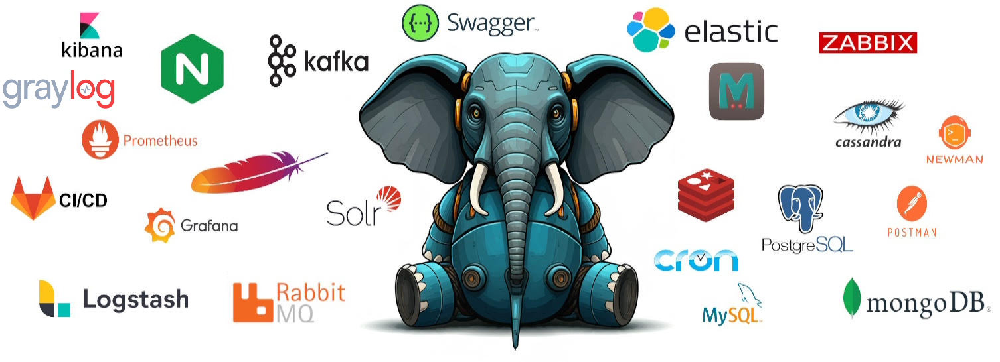

# Enterprise Skeleton Project



This repository serves as a foundational skeleton for starting any new project. It is designed to streamline development by integrating support for all essential and popular services that developers commonly need.

---

# Initial Setup

1. Copy the configuration template:
```bash
make copy-config
```

2. Configure your environment:
   Edit `infrastructure/config/cs-config` to enable/disable services.

3. Start:
```bash
make install
```

# Infrastructure

PHP container will be build automatically depend on which services you choose. 

| Category          | Services                  | Version                        | Browser URL                                     |
|-------------------|---------------------------|--------------------------------|-------------------------------------------------|
| Language          | • PHP                     | v8.3                           | -                                               |
| Web Servers       | • Nginx<br>• Apache       | • stable-alpine<br>• v2.4      | http://localhost:1000<br>https://localhost:1001 |
| Databases         | • PostgreSQL<br>• MySQL   | • v15<br>• v8.0                | -                                               |
| NoSQL Database    | • MongoDB<br>• Cassandra  | • v6.0<br>• v4.1               | -                                               |
| Cache             | • Redis<br>• Memcached    | • v7.2-alpine<br>• v1.6-alpine | -                                               |
| Message Brokers   | • RabbitMQ<br>• Kafka     | • latest<br>• latest           | http://localhost:15672<br>http://localhost:8080 |
| Search            | • Elasticsearch<br>• Solr | • latest<br>• latest           | -                                               |
| Monitoring        | • Zabbix<br>• Grafana     | • latest<br>• latest           | http://localhost:8081<br>http://localhost:3000  |
| Mail Sandbox      | • Mailhog<br>• Papercut   | • latest<br>• latest           | http://localhost:8025<br>http://localhost:37408 |
| Log Management    | • Kibana<br>• Graylog     | • latest<br>• latest           | http://localhost:5601<br>http://localhost:9400  |
| API Documentation | • Swagger                 | latest                         | http://localhost:8080/api/docs                  |
| Scheduling Jobs   | • Cron                    | latest                         | -                                               |
---

# Project Structure

## Modular Architecture
The project follows a domain-driven modular architecture:
- Each domain is a separate module in `src/`
- Modules are independent and loosely coupled
- Each module contains its own:
  - Business logic
  - Infrastructure
  - Configuration
  - Tests

## Independent Configuration
- Configuration is modular and domain-specific
- Each module can have its own configuration
- Shared configuration is minimal and clearly separated
- Environment-specific settings use `.env` files

## How adding new domain models

1. Add new Domain Model to the `/src` directory by example `code/src/YourDomain`
2. Register it in the domain configuration `code/config/packages/domains.yaml`

### Health check

The project includes a set of health check commands to monitor various services.

All commands return:
- Success (0): When the service is available and functioning correctly
- Failure (1): When there are connection issues or service malfunctions

Usage example:
```bash
# Test MySQL connection
php bin/console app:healthcheck:mysql
```
---

# Tools

The project includes several code quality and analysis tools:

### PHP CS Fixer
- Automatically fixes PHP coding standards
- Run: `make phpcs`

### Deptrac
- Enforces architectural boundaries and dependencies
- `tools/deptrac-layers.yaml`: Checks dependencies between layers to maintain clean architecture
- `tools/deptrac-domain.yaml`: Validates dependencies between different domains to prevent unwanted coupling
- Run: `make deptrac`

### PHPStan
- Static analysis tool for finding code errors
- Run: `make phpstan`

### Psalm
- Advanced static analysis and type checking
- Run: `make psalm`

### PHPUnit
- Testing framework with automatic test suite discovery
- Run: `make test-php`

### Newman
- Testing Postman collection using Newman
- Run: `make test-postman`
---

## Elasticsearch, Kibana & Logstash (ELK) Configuration

1. Create index
```bash
  curl -X PUT http://localhost:9200/logs -H Content-Type: application/json -d {"settings":{"number_of_shards":1,"number_of_replicas":0},"mappings":{"properties":{"@timestamp":{"type":"date"},"message":{"type":"text"},"level":{"type":"keyword"},"channel":{"type":"keyword"},"context":{"type":"object"}}}}
```
2. Reload logstash
```bash
docker compose -f infrastructure/docker-compose-tools.yml --profile elk restart logstash
```

---

## Graylog Configuration

1. Run `composer req graylog2/gelf-php`

## Configure UDP Input
1. Open http://localhost:9400 in your browser
2. Login with your admin credentials
3. Go to System → Inputs
4. Select "GELF UDP" from the dropdown
5. Click "Launch new input"
6. Configure with:
  - Title: "GELF UDP Input"
  - Port: 12201
  - Bind address: 0.0.0.0
7. Save the configuration

## Postman Collection

The project includes a Postman collection located at: `infrastructure/postman`

The collection includes examples for authorization, API endpoints, and automated tests.

### How to Use
1. Open [Postman](https://www.postman.com/).
2. Import the collection file from `infrastructure/postman`.
3. Set up environment variables like `base_url` and `auth_token` if needed.
4. Use the ready-to-go requests to interact with the API.

### Automated Testing with Newman
- Newman is integrated for automated Postman collection testing
- Run tests using: `make test-postman`

## Request-ID Tracking

The application implements request tracking using Request-IDs with the following features:

- **Automatic Request-ID Generation**:
  - Inspects incoming requests for the `Request-Id` header
  - If no request ID is found, automatically generates a version 4 UUID
  - Ensures every request has a unique identifier for tracking

## SSL/HTTPS Support

The project includes HTTPS support with the following features:

- Self-signed SSL certificates for development
- Automatic HTTP to HTTPS redirect
- Modern SSL protocols (TLSv1.2, TLSv1.3)
- Secure cipher configuration

### SSL Certificates

For development, self-signed certificates are used. For production, replace the certificates in `etc/containers/nginx/ssl/` with your own SSL certificates:
- `nginx-selfsigned.crt`: SSL certificate
- `nginx-selfsigned.key`: Private key

## Cron

The project includes a built-in cron job scheduler for running automated tasks. Cron jobs are managed through Docker containers, ensuring consistent execution across different environments.

### Configuration

Cron jobs are defined in the `infrastructure/crontab` file. Each line follows the standard cron format:

```
* * * * * command-to-execute
```

### Available Commands

The following commands are available for cron management:

```bash
# View current cron jobs
docker-compose exec cron crontab -l

# Edit cron jobs
docker-compose exec cron crontab -e

# View cron logs
docker-compose logs cron
```

### Best Practices

- Always redirect output to logs (`>> /var/log/cron.log 2>&1`)
- Use absolute paths in cron commands
- Keep the cron schedule in version control
- Monitor cron job execution through logs

---

# Contributing

We welcome contributions to the Enterprise Skeleton project! If you'd like to join the development effort, you can contribute by creating Pull Requests (PRs).

### Current Development Priorities

We are currently looking for contributions in the following areas:

- **Sentry Integration**: We need help implementing Sentry for error tracking and monitoring. If you have experience with Sentry integration in Symfony applications, we'd love your contribution!

- **RoadRunner Integration**: We are looking to integrate RoadRunner as a high-performance PHP application server. If you have experience with RoadRunner implementation, particularly in Symfony applications, your contribution would be valuable!

### How to Submit a Pull Request

1. Fork the repository
2. Create a new branch for your feature or fix
3. Make your changes following our coding standards
4. Write or update tests if necessary
5. Submit a Pull Request with a clear description of the changes
6. Ensure all checks pass (PHPStan, Psalm, CS-Fixer, etc.)

---

## License

This project is licensed under the MIT License.

## Author
[Dykyi Roman](https://dykyi-roman.github.io/)